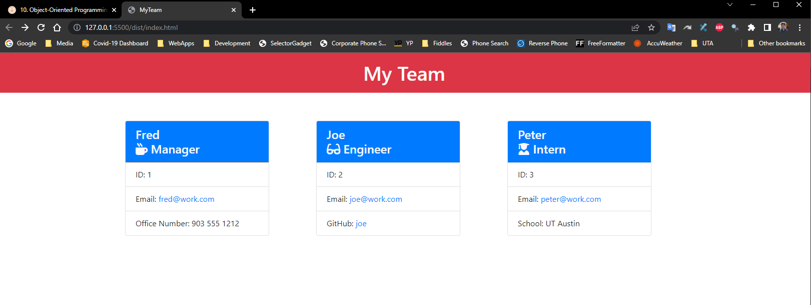
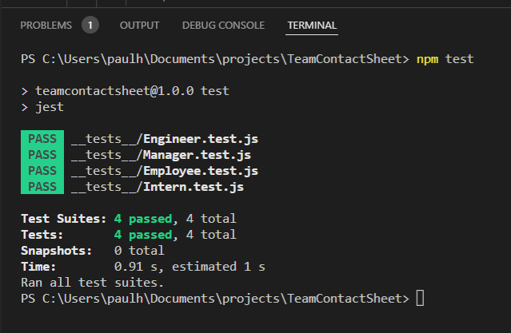

# TeamContactSheet

## License
MIT<br>
[](https://opensource.org/licenses/MIT)

## Description
This project creates a quick contact sheet for any dev team.<br>A user is presented with prompts to answer questions about work and colleagues.<br>After the prompts, you are given a HTML file inside the dist folder.<br>It's a fast way to create an HTML page from user input. 

## Table of Contents
* [Description](#description)
* [License](#license)
* [Installation](#installation)
* [Usage](#usage)
* [License](#license)

## Installation
1. Go to package.json. You will see that inquirer and jest packages are required.<br>2. Do a ```npm install inquirer```<br>3. Do a ```npm install jest```.<br>4. As prerequisite, you should already have Node.js installed. 

## Usage
<br>

## Contribute
Contributors may request acces via email or linkedin.<br>Clone repo.<br>Make a PR.

## Testing
1. TDD is supported using jest.<br>2. Make sure you have npm jest package installed. <br>3. Open a node-compliant terminal and run ```npm test```.

## Questions
GitHub User Name: phaberle<br>
Email Address: paulshaberle@gmail.com

### How to reach me with additional questions:
Contributors may contact me through email.<br>I try to check my email often.<br>But it may take a while to receive a reply.
